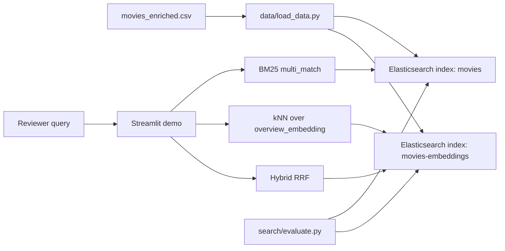

# Architecture

Flavours of Elastic is now structured as a reproducible local search product demo plus a course lab.

## Reviewer Path

## Data Flow

- `data/movies_enriched.csv` is the source of truth for the full dataset.
- `data/movies_enriched_1000.csv` is the small local-review dataset source.
- `data/load_data.py` normalizes rows into stable fields: `id`, `title`, `year`, `genres`, `overview`, multilingual text fields, and `searchable_text`.
- `--with-embeddings` creates deterministic 384-dimensional local embeddings so vector and hybrid demos work without network downloads.
- `data/generate_embeddings.py` can replace deterministic vectors with model-backed `all-MiniLM-L6-v2` embeddings when ML dependencies are installed.

## Retrieval Modes

- `bm25`: lexical search over title, overview, description, and genres.
- `dense`: kNN over `overview_embedding`.
- `hybrid_rrf`: Elasticsearch Retriever API with BM25 and kNN fused by reciprocal rank fusion.
- `elser`: reserved for the ML stack and `semantic_text` exercises.

## Tradeoffs

- Local deterministic embeddings prioritize reproducibility over semantic quality.
- Model-backed embeddings improve quality but require ML dependencies and model downloads.
- Elastic Single is the default reviewer target because it gives the lowest-friction demo path.
- Elastic ML remains available for ELSER and semantic_text, but is treated as a heavier advanced path.
