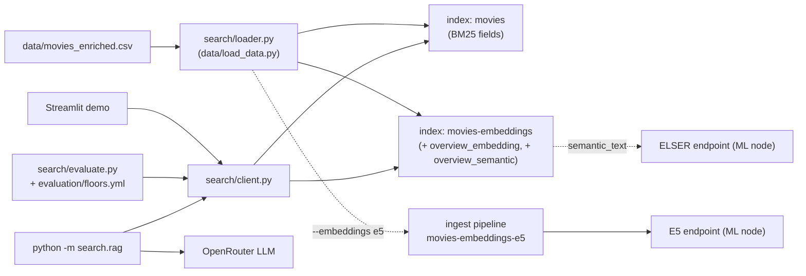
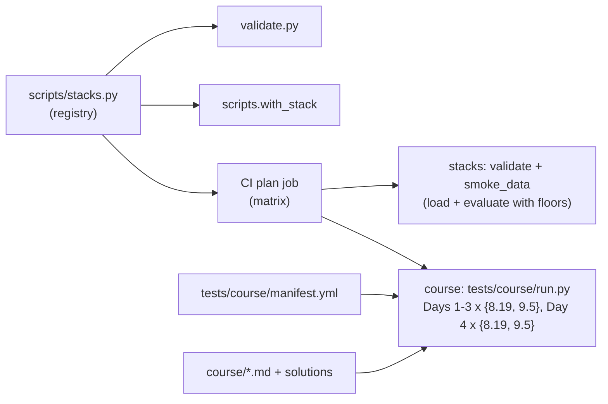

# Architecture

Flavours of Elastic is a reproducible local search playground plus a 4-day course lab, verified by CI on
Elasticsearch 8.19 and 9.5 (see ADR 0008).

## Search Path

```mermaid
flowchart LR
  CSV["data/movies_enriched.csv"] --> Loader["search/loader.py<br/>(data/load_data.py)"]
  Loader --> M["index: movies<br/>(BM25 fields)"]
  Loader --> ME["index: movies-embeddings<br/>(+ overview_embedding, + overview_semantic)"]
  Loader -. "--embeddings e5" .-> Pipe["ingest pipeline<br/>movies-embeddings-e5"]
  Pipe --> E5["E5 endpoint (ML node)"]
  ME -. "semantic_text" .-> ELSER["ELSER endpoint (ML node)"]
  Client["search/client.py"] --> M
  Client --> ME
  App["Streamlit demo"] --> Client
  Eval["search/evaluate.py<br/>+ evaluation/floors.yml"] --> Client
  RAG["python -m search.rag"] --> Client
  RAG --> LLM["OpenRouter LLM"]
```

`search/config.py` decides which cluster to use (`--stack`, `--url`, the environment from `scripts.with_stack`,
or auto-detection), and `search/capabilities.py` reads what it can do (distribution, licence, ML nodes). The
client picks queries from that: kNN or OpenSearch `knn`, the `rrf` retriever or client-side fusion, a local
query vector or `query_vector_builder`.

## Stacks, CI and the Course

```mermaid
flowchart LR
  Reg["scripts/stacks.py<br/>(registry)"] --> Val["validate.py"]
  Reg --> WS["scripts.with_stack"]
  Reg --> Plan["CI plan job<br/>(matrix)"]
  Plan --> Stacks["stacks: validate + smoke_data<br/>(load + evaluate with floors)"]
  Plan --> Course["course: tests/course/run.py<br/>Days 1-3 x {8.19, 9.5}, Day 4 x {8.19, 9.5}"]
  Man["tests/course/manifest.yml"] --> Course
  Decks["course/*.md + solutions"] --> Course
```

Every stack runs in an isolated compose project (`foe-<purpose>-<stack>`), so tooling never touches a student's
own stack or data.

## Data Flow

- `data/movies_enriched.csv` is the source of truth (5,100 movies); `--size small` loads the curated 200-movie
  sample listed in `data/movies_small_ids.txt`.
- `data/load_data.py` (implemented in `search/loader.py`) normalizes rows into stable fields: `id`, `title`, `year`,
  `genres`, `overview`, `vote_average`, multilingual text fields, and `searchable_text`.
- `--embeddings hash` adds deterministic 384-dimensional local vectors so vector and hybrid demos work offline.
- `--embeddings e5 --with-elser` (ML stacks) embeds `searchable_text` in the cluster with multilingual E5 through
  an ingest pipeline and adds an ELSER `semantic_text` field.

## Retrieval Modes

- `bm25`: lexical search over title, overview, descriptions (en/fr/kk), and genres.
- `dense`: kNN over `overview_embedding` (query vectors from the backend recorded in the index `_meta`).
- `hybrid_rrf`: BM25 and kNN fused by reciprocal rank fusion — the `rrf` retriever on a trial licence,
  client-side fusion otherwise.
- `elser`: the `semantic` query on `overview_semantic`; `hybrid_all`: BM25 + kNN + ELSER.
- `python -m search.rag` uses any of these modes to retrieve context for an LLM answer.

## Tradeoffs

- Hash embeddings work offline on any stack but are lexical; in-cluster E5 is semantic and multilingual but needs
  an ML stack (trial licence, ~2 GB of ML memory per model) and a first-run model download.
- Client-side fusion keeps hybrid search available on a basic licence and OpenSearch; the `rrf` retriever is
  simpler and saves a round trip where licensed.
- Elastic Single is the default reviewer target because it gives the lowest-friction demo path; the ML stacks are
  the semantic-search path (Day 4, `make load-ml`).
