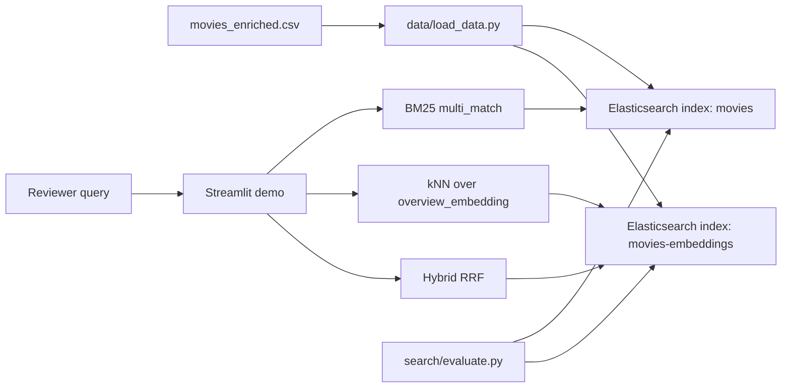

# Architecture

Flavours of Elastic is now structured as a reproducible local search product demo plus a course lab.

## Reviewer Path

```mermaid
flowchart LR
  CSV["movies_enriched.csv"] --> Loader["data/load_data.py"]
  Loader --> ES["Elasticsearch index: movies"]
  Loader --> ESV["Elasticsearch index: movies-embeddings"]
  Query["Reviewer query"] --> App["Streamlit demo"]
  App --> BM25["BM25 multi_match"]
  App --> Dense["kNN over overview_embedding"]
  App --> RRF["Hybrid RRF"]
  BM25 --> ES
  Dense --> ESV
  RRF --> ESV
  Eval["search/evaluate.py"] --> ES
  Eval --> ESV
```

## Data Flow

- `data/movies_enriched.csv` is the source of truth (5,100 movies); `--size small` loads the curated 200-movie
  sample listed in `data/movies_small_ids.txt`.
- `data/load_data.py` (implemented in `search/loader.py`) normalizes rows into stable fields: `id`, `title`, `year`,
  `genres`, `overview`, `vote_average`, multilingual text fields, and `searchable_text`.
- `--embeddings hash` adds deterministic 384-dimensional local vectors so vector and hybrid demos work offline.
- `--embeddings e5 --with-elser` (ML stacks) embeds `searchable_text` in the cluster with multilingual E5 through
  an ingest pipeline and adds an ELSER `semantic_text` field.

## Retrieval Modes

- `bm25`: lexical search over title, overview, descriptions (en/fr/kk), and genres.
- `dense`: kNN over `overview_embedding` (query vectors from the backend recorded in the index `_meta`).
- `hybrid_rrf`: BM25 and kNN fused by reciprocal rank fusion — the `rrf` retriever on a trial licence,
  client-side fusion otherwise.
- `elser`: the `semantic` query on `overview_semantic`; `hybrid_all`: BM25 + kNN + ELSER.
- `python -m search.rag` uses any of these modes to retrieve context for an LLM answer.

## Tradeoffs

- Local deterministic embeddings prioritize reproducibility over semantic quality.
- Model-backed embeddings improve quality but require ML dependencies and model downloads.
- Elastic Single is the default reviewer target because it gives the lowest-friction demo path.
- Elastic ML remains available for ELSER and semantic_text, but is treated as a heavier advanced path.
